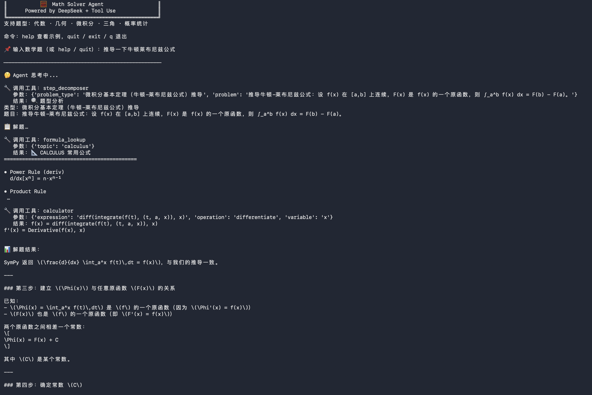
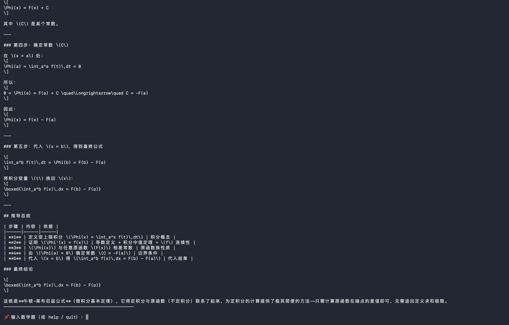

# 🧮 Math Solver Agent

> A Python CLI agent that solves math problems step-by-step using **DeepSeek** and the **OpenAI-compatible Tool Use API**.
>
> 基于 DeepSeek + Tool Use 构建的数学解题 Agent，展示 AI Agent 架构核心能力。
>
> 独立设计并实现，无框架依赖，手动实现完整 Agentic Loop。

---

## Architecture / 架构

```
main.py          ← CLI 入口，对话循环
agent.py         ← Agentic Loop（核心）：调 API → 执行工具 → 循环
tools.py         ← 工具定义（JSON Schema）+ 工具实现（SymPy）
```

**Three tools / 三个工具：**

| Tool | Description |
|------|-------------|
| `step_decomposer` | 分析题型，生成解题路线图（先规划再计算）|
| `formula_lookup` | 从内置公式库检索相关公式（代数/几何/微积分…）|
| `calculator` | 基于 SymPy 的符号计算引擎（求导/积分/解方程…）|

**Agent loop 流程：**
```
用户输入
  → DeepSeek Chat (Tool Use)
  → stop_reason == "tool_use"  → 执行工具 → 把结果塞回对话 → 继续
  → stop_reason == "end_turn"  → 输出最终解答
```

---

## Setup / 安装

```bash
# 1. 克隆项目
git clone https://github.com/Heliotrope-dev/math-agent.git
cd math-agent

# 2. 安装依赖
pip install openai sympy

# 3. 设置 API Key（从 https://platform.deepseek.com 获取）
export DEEPSEEK_API_KEY="sk-..."   # macOS/Linux
# 或 Windows: set DEEPSEEK_API_KEY=sk-...

# 4. 运行
python main.py
```

---

## Demo / 演示

**Agentic Loop 运行过程**（三个工具依次调用）：



**最终输出**（牛顿-莱布尼兹公式完整推导）：



---

## Example / 示例

```
📌 输入数学题：解方程 2x² + 5x - 3 = 0

🤔 Agent 思考中...

🔧 调用工具：step_decomposer
🔧 调用工具：formula_lookup   (topic: algebra)
🔧 调用工具：calculator        (solve: 2*x**2 + 5*x - 3 = 0)

📊 解题结果：

**解题思路**
这是一个标准二次方程，使用求根公式求解。

**分步解答**
1. 识别系数：a=2, b=5, c=-3
2. 代入求根公式：x = (-5 ± √(25+24)) / 4 = (-5 ± 7) / 4
3. 两个解：x₁ = 1/2,  x₂ = -3

**最终答案**
x = 1/2  或  x = -3
```

---

## Key Design Decisions / 设计要点

- **`deepseek-chat`** — 速度快、支持 Tool Use，兼容 OpenAI SDK，适合 agentic 场景
- **手动维护 messages 列表**，每轮把 assistant 消息和 tool result 追加进去，循环直到 finish_reason != tool_calls
- **SymPy** 做符号计算 — 精确，无浮点误差，支持代数化简
- **公式库 + 步骤分解** — 让模型输出有结构的教学式解答，而不只是答案

---

*Built with Claude Code · 蒋天奇 · 2026*
